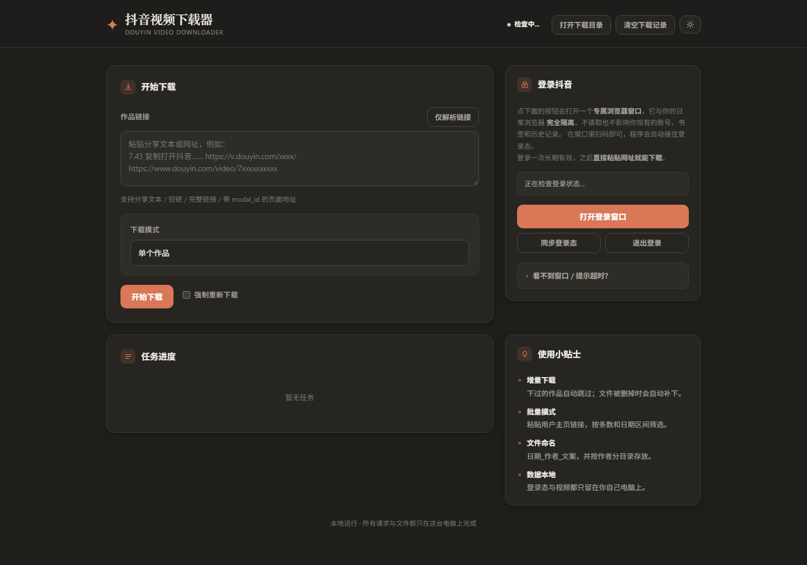
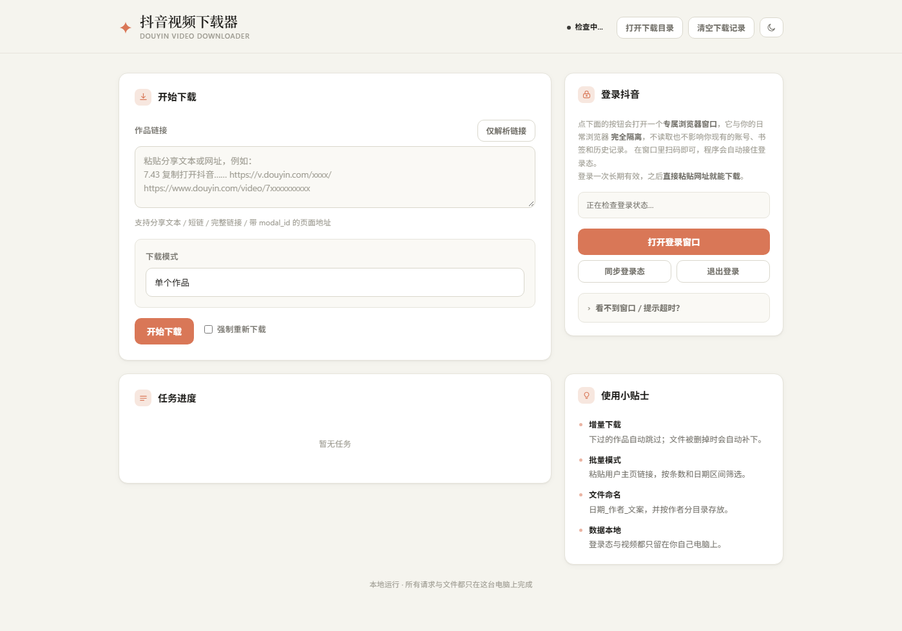
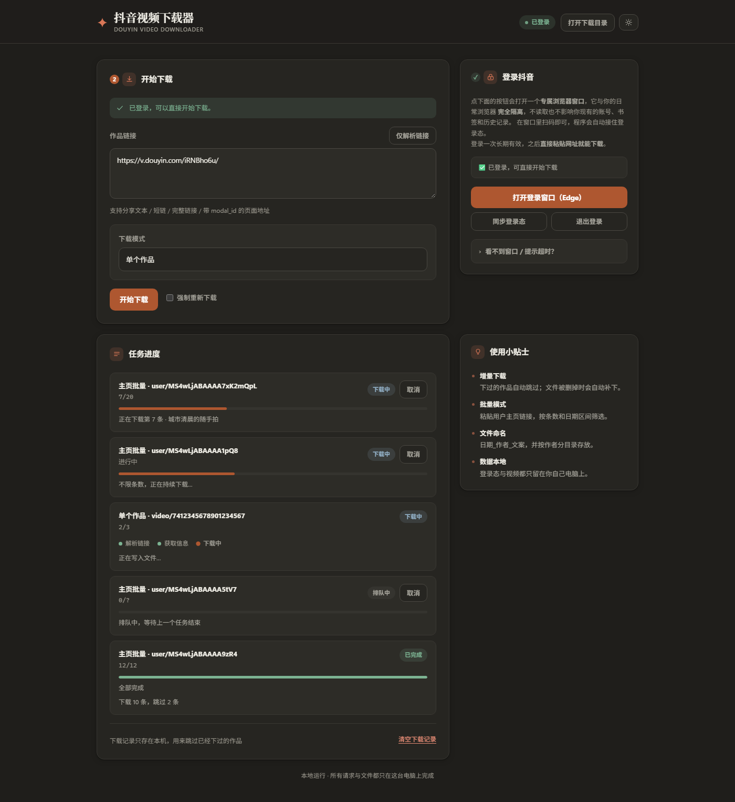
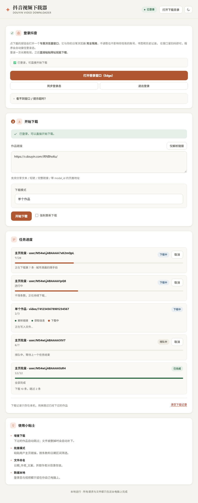

# 历史快照说明

本报告保留原调查时的结构与行号，不代表 2026-10-06 后的全部代码。
当前系统修复、运行和验证方式见 [系统完善说明.md](系统完善说明.md)。

# 抖音视频下载器 · 项目框架结构报告

| 项目 | 内容 |
| --- | --- |
| 报告对象 | `<项目根目录>` |
| 生成时间 | 2026-09-29 |
| 报告口径 | 全部事实来自**源码实读 + 命令实测**，关键结论标注 `文件:行号` |
| 报告定位 | **架构与环境视角**的独立快照。面向使用者的操作步骤见根目录 `README.md` 与 `docs/使用说明.md`，本报告不重复其内容 |

---

## 一、一页速览

**一句话定位**：一个「把开源库 f2 的爬取能力，包装成双击即用的 Windows 桌面工具」的工程项目 —— 真正的工程量不在爬虫本身，而在**打包、登录态获取、进程生命周期、文件落盘可靠性**这四件事上。

| 维度 | 实测数值 |
| --- | --- |
| 形态 | 单文件 exe（PyInstaller onefile，无控制台窗口，带图标）+ 本地 Web 界面 |
| 规模 | Python 源码 **7 个模块 / 3027 行**；前端 **1 个 HTML / 867 行**（内联 CSS+JS）；打包脚本 5 个 |
| 语言/运行时 | Python **3.13.14**（独立 venv，与系统环境隔离） |
| 核心依赖 | `f2 0.0.1.7`（签名/接口/下载器）、`Flask 3.1.3`、`PyYAML 6.0.2` |
| 前端 | 原生 HTML/CSS/JS，零构建、零框架，`fetch` + `sendBeacon` |
| 后端接口 | **17 条** Flask 路由 |
| 测试 | 6 个独立断言脚本，约 **91 项断言**；`run_all.py` 一键跑 5 个 |
| 交付物 | 安装程序 **29.0 MB**（Inno Setup）+ 绿色版 zip **27.2 MB** |
| 项目体积 | **492 MB**（2026-09-29 整理前为 591 MB；其中 `dist/` 454 MB 为交付目录+运行时数据混放） |

**架构判断**：分层清晰（入口 → 服务 → 能力 → 支撑），依赖方向单向可控，只有一处**有意的双向依赖**（`config ↔ console`）用函数内延迟 import 化解。设计上最值得肯定的是「**路径落点单点化**」与「**打包脚本显式取源、绝不扫目录**」两条硬约束；最大的结构性隐患是 `dist/` 目录把**交付产物**和**含真实 Cookie 的运行时数据**放在了一起。

---

## 二、项目定位与范围

### 2.1 目标用户路径

```
双击 exe ──▶ 自动开浏览器 ──▶ 点一次按钮扫码登录 ──▶ 粘贴链接 ──▶ 实时进度 ──▶ 文件落地
                (Flask 起 127.0.0.1)      (CDP 独立 profile)      (Web UI)     (f2 下载)
```

### 2.2 功能范围（已实现的边界）

| 能力 | 说明 |
| --- | --- |
| 单作品下载 | 粘贴分享链接下载无水印视频 |
| 用户主页批量 | 一次性下载某作者全部/部分作品，**默认 20 条**（`config.py` 的 `default_max_counts: 20`） |
| 链接形态兼容 | 分享文本 / 短链 / `/video/` / `/note/` / `?modal_id=` 等 17 类形态 |
| 只下视频 | `build_kwargs()` 显式关闭 `music` / `cover` / `desc`（`core.py:173-189`） |
| 增量下载 | 重复运行跳过已下载；**文件被删会自动重下** |
| 日期区间筛选 | `--date-start` / `--date-end`，落到 `_in_date_range()`（`core.py:595`） |
| 自定义命名 | 默认 `{create}_{nickname}_{desc}`，自动清理非法字符 |
| 本地运行 | 只绑 `127.0.0.1`，数据不出本机 |

### 2.3 明确不做的事

- 不实现 `a_bogus` / `msToken` 等签名算法 —— 全部委托 f2。
- 不下载音频、封面、文案（只下视频）。
- 不依赖 ffmpeg（实测本机未安装，方案也不需要）。

---

## 三、技术栈与运行环境（实测）

### 3.1 Python 环境

| 项 | 实测值 |
| --- | --- |
| 解释器 | `C:\Users\<用户名>\.workbuddy\binaries\python\envs\default\Scripts\python.exe` |
| 版本 | **Python 3.13.14** |
| venv 隔离 | `include-system-site-packages = false`（不继承系统包） |
| venv 基座 | `...\binaries\python\versions\3.13.12` |
| pip | 26.1.2 |
| f2 版本要求 | **`Requires-Python: >=3.10`**（`f2-0.0.1.7.dist-info/METADATA`） |

> ⚠️ **已知陷阱**：本机另有一个 Python 环境 `E:\Professional\py\python.exe`（3.13.3，**未安装 f2**），全局 `pip` 指向它。因此装包必须写**绝对路径的 `pip.exe`**。另外 venv 的 `python.exe` 在 `Scripts\` 下，不在 `envs\default\` 根。

### 3.2 依赖清单

运行时（`requirements.txt`）：

| 包 | 声明约束 | 实测版本 | 用途 |
| --- | --- | --- | --- |
| f2 | `>=0.0.1.7` | **0.0.1.7** | 抖音签名、接口、下载器 |
| Flask | `>=3.0` | **3.1.3** | 本地 Web 界面 |
| PyYAML | `>=6.0` | **6.0.2** | 配置文件读写 |

开发时（`requirements-dev.txt`）：`pyinstaller >=6.0` → 实测 **6.22.3**。

f2 自动带入且被 spec 显式收集的传递依赖：`httpx 0.27.2`、`gmssl 3.2.2`、`PyExecJS 1.5.1`、`pydantic 2.9.2`、`jsonpath-ng 1.6.1`、`browser-cookie3 0.20.1`、`pycryptodomex 3.23.0`、`websockets **12.0**`（项目直接用于 CDP）。

### 3.3 f2 库：关键行为核查（逐条实测）

报告里所有关于 f2 的论断都重新验证过，结论如下 —— 这些行为是项目**大量补丁代码的直接原因**：

| 待核实事实 | 结论 | 证据 |
| --- | --- | --- |
| `DouyinHandler` 类存在 | ✅ | `f2/apps/douyin/handler.py:93` |
| `fetch_user_post_videos` 是**异步生成器** | ✅ | `handler.py:365` 定义，返回 `AsyncGenerator[UserPostFilter, Any]`，函数体含 `yield` |
| `format_file_name(naming, data)` 是公开函数 | ✅ | `f2/apps/douyin/utils.py:1462` |
| 「文件已存在则跳过」逻辑 | ✅ **`base_downloader.py:543`** | `initiate_download()`（`:512`）内 `if full_path.exists():` → 打印「跳过」并 return |
| `split_filename()` 按**加权长度**判定、按**字符数**截断 | ✅ | `f2/utils/utils.py:350`；`total_length = 中文数×3 + 字母数 + 下划线数`，超 `os_limit[win32]=200` 时截取 |
| f2 日志写向 CWD 下的 `./logs` | ✅ | `f2/log/logger.py:136` `temp_log_dir = Path("./logs")` |
| `conf.yaml` 默认开 Bark 通知 | ✅ | `f2/conf/conf.yaml:4` `enable_bark: true`（无 key 时会向 `api.day.app` 刷 405） |

### 3.4 其他工具链

| 工具 | 状态 |
| --- | --- |
| Node.js | **v22.22.2**（npm 10.9.7）—— 本方案不依赖，仅环境事实 |
| Inno Setup 6 | ✅ 已装：`C:\Users\<用户名>\AppData\Local\Programs\Inno Setup 6\ISCC.exe`（user scope，不污染系统） |
| ffmpeg | ❌ **不可用**（PATH 中无；仅 Proteus 自带一份，非通用安装） |
| 桌面路径 | `C:\Users\<用户名>\Desktop`（无 OneDrive 变体） |
| 项目磁盘 | E: 盘，剩余 593 G 可用 |

> Inno Setup 的精确补丁版本**无法从文件读取**（ISCC.exe 的版本资源被剥离为 `0.0.0.0`）；随附语言文件头写的是 `6.5.0+`，项目记忆中记录为 6.7.3。

---

## 四、目录布局

### 4.1 分层原则

> **按「来源」分三层**，根目录只留第 ① 层。

| 层 | 目录 | 性质 | 版本控制 |
| --- | --- | --- | --- |
| ① 工程文件（人写） | `src/` `web/` `tests/` `build/` `docs/` + `secure/` 的脚本部分 | 代码、文档、打包脚本、保险箱脚本 | 进仓库 |
| ② 构建产物（脚本生成） | `dist/` `build_tmp/` `release/` | 可删、可重建 | 忽略 |
| ③ 运行时数据（含凭据） | `data/` + `secure/` 的归档部分 | 本地生成，含登录凭据 | 忽略 |

第 ② 层的三个目录都是「用完即弃」的：`build_tmp/` 是 PyInstaller 中间产物（`build.bat` 每次打包前先删），`release/` 是分享包输出（跑 `build_installer.bat` 才生成）。
`dist/` 现在**只剩构建产物**（`douyin-tool.exe` + `README.md` + `data_dir.txt`）—— 运行时数据经指针文件统一归入 `data/`，见下一条整理记录。

> **2026-09-29 目录整理记录**：清掉 `build_tmp/`（43 MB）、项目根 `logs/`（0 字节异常残留）、过期的 `release/`（57 MB）、临时目录 `.tmp_shot/`；把散落的界面截图归入 `docs/images/`、UI 设计稿归入 `docs/design/`；新增 `secure/` 凭据保险箱。项目体积 **591 MB → 492 MB**，根目录顶层只剩第 ① 层 + `data/` `dist/` `secure/`。

> **2026-09-29 21:10 目录整理记录（第二轮）**：
> - **`dist/` 拆分**（解决长期悬置的「混放风险」）：旧 `dist/` 里同时躺着 74 MB 登录态、35 MB 缓存、418 MB 下载视频、含 Cookie 的 `config.yaml`。现改为给冻结态加**数据目录指针**（`dist/data_dir.txt`，内容 `../data`），`src/config.py::get_data_dir()` 识别后把数据写到 `data/`，`dist/` 只剩 exe + README + 指针。分享包里不含指针文件，**接收方行为与历史版本完全一致**。
> - **数据合并**：`dist/` 那套（含 6022 字符真实 Cookie）与 `data/` 那套（Cookie 为空但 profile 更新）**取各自最新项**合并进 `data/`，4 个视频（418 MB）一并迁入 `data/Download/`。
> - **清理**：`build_tmp/`（48 MB）、`src/__pycache__/`、6 份重复的 `index.html` 快照、TEMP 孤儿 `_MEI000010902`（56 MB）；根目录 5 张窗口按钮截图归入 `docs/images/winbtn/`；`docs/images/` 4 张未被文档引用的过程图回收进垃圾桶。
> - **修掉一个交付物污染**：`web/templates/index.html.before-winbtn` 会被 spec 的 `(WEB_DIR/templates, "web/templates")` **打进 exe**。已移到 `docs/probes/` 并同步改 `verify_buttons.py` 的路径。
> - **脚本路径收口**：`check_narrow.py` 不再往 `build_tmp/` 输出探针页；`grab_buttons.py`／`verify_esc.py` 不再硬编码 `dist/running.json`，改走 `get_data_dir()`；`audit_release.py` 的 Cookie 指纹改从 `data/config.yaml` 取；`secure/seal.py` 凭据清单 8 项 → 4 项。
> - 体积：`dist/` **561 MB → 32 MB**，`data/` 87 MB → 505 MB（其中 418 MB 是实际下载的视频）。

### 4.2 目录清单（实测文件数与性质）

| 目录 | 文件数 | 主要扩展名 | 性质 |
| --- | --- | --- | --- |
| `src/` | 9 | `.py` | **人写**：应用代码（3929 行） |
| `web/` | 2 | `.html` `.gitkeep` | **人写**：单文件前端 |
| `tests/` | 10 | `.py` `.md` | **人写**：测试脚本 |
| `build/` | 10 | `.py` `.bat` `.iss` `.spec` `.isl` `.ico` `.png` `.txt` | **人写**：打包配置与脚本 |
| `docs/` | 29 | `.md` 5 / `.png` 11 / `.py` 8 / `.js` 1 / `.html` 4 | **人写**：文档 + 设计稿 + 预览图 + 验证脚本 |
| `secure/` | 5 | `.py` 2 / `.bat` 2 / `.md` 1 | **人写**：凭据保险箱（封存/解封脚本与说明） |
| `data/` | 1016 | 无扩展名为主 / `.log` / `.json` / `.db` / `.yaml` / **`.mp4` 4** | **机器生成**：运行时数据（含凭据 + 418 MB 下载视频） |
| `dist/` | 3 | `.exe` 1 / `.md` 1 / `.txt` 1 | **交付目录**：只放构建产物（exe + README + 数据指针） |

### 4.3 运行时数据落点（两态对照）

这是本项目最重要的一条设计约定，由 `src/config.py` **单点决定**，代码里没有第二处硬编码：

| 函数 | 冻结态（双击 exe） | 开发态（跑源码） |
| --- | --- | --- |
| `get_app_dir()` `config.py:96` | `exe 所在目录` | 项目根 |
| `_redirected_data_dir()` `config.py:113` | ★ **本轮新增**：读 `data_dir.txt` / `DOUYIN_DATA_DIR`，没配返回 `None` | 不启用 |
| `get_data_dir()` `config.py:138` | 默认为 `get_app_dir()`（不套 `data/`）；**有指针时改写为指针目标** | `<项目根>/data/` |
| `get_resource_dir()` `config.py:166` | `sys._MEIPASS`（PyInstaller 解压临时目录） | 项目根 |
| `get_config_path()` `config.py:176` | `数据目录/config.yaml` | `<项目根>/data/config.yaml` |
| `get_history_path()` `config.py:180` | `数据目录/download_history.json` | `<项目根>/data/download_history.json` |
| `resolve_download_dir()` `config.py:184` | 相对路径基于**数据目录**解析 | 同左，基于 `<项目根>/data/` |

> ★ **冻结态默认不套 `data/` 子目录**，这是有意为之：老用户的 Cookie / 登录态 / 下载记录本来就在 exe 旁边，加一层目录等于「数据凭空消失」。**不要顺手"优化"成 `<exe目录>/data/`。**
> 需要让 `dist/` 只留构建产物时，走**显式重定向** —— exe 同级放 `data_dir.txt`，或设环境变量 `DOUYIN_DATA_DIR`（后者优先）。分享包里不含这两个开关，接收方行为一字不变。

路径出口**只有这 6 处**，除此之外全项目无硬编码数据目录：

```
config.get_config_path / get_history_path / resolve_download_dir
console._log_path
browser_login.profile_dir
core._prepare_f2_env()   ← 靠一次 os.chdir 决定 f2 全部产物的落点
```

### 4.4 关键：f2 的产物是怎么被收进数据目录的

f2 的日志目录与用户库都是**按当前工作目录（CWD）解析的相对路径**：

- `f2/log/logger.py:136` → `Path("./logs")`
- `f2/apps/douyin/{handler,dl}.py` 共 15 处 `AsyncUserDB("douyin_users.db")`

所以 `core._prepare_f2_env()`（`core.py:34`）在 **`import f2` 之前**做两件事：
1. `os.chdir(get_data_dir())` —— 一次 chdir 决定所有 f2 产物的落点；
2. 抢占 `logging.getLogger("f2")` 并预挂 handler —— 让 f2 的 `log_setup()` 检测到「已有 handler」而跳过自建。

### 4.5 目录树

```
<项目根目录>\                                  【① 工程层】
├── src/                        应用代码（Python 包，3027 行）
│   ├── main.py                 统一入口：Web 界面 + 命令行
│   ├── core.py                 对 f2 的封装：下载编排 / 链接解析 / 落盘 / 命名
│   ├── config.py               路径解析（两态）+ 配置读写 + 下载历史 v2
│   ├── console.py              无控制台输出兼容 + 崩溃兜底 + 日志落盘
│   ├── browser_login.py        CDP 自动登录（独立 profile 浏览器）
│   ├── cookie_reader.py        浏览器探测 + Cookie 文本解析校验
│   ├── web_app.py              Flask 服务（17 路由）+ 任务表 + 生命周期看门狗
│   └── __init__.py             包声明，__version__ = "1.0.0"
│
├── web/
│   ├── templates/index.html    单文件界面（867 行，内联 CSS+JS，零构建）
│   └── static/.gitkeep
│
├── tests/                      自带断言的独立脚本（非 pytest）
│   ├── run_all.py              一键跑 5 个，汇总结果
│   ├── test_link_parse.py      链接解析 42 项（纯离线）
│   ├── test_history.py         增量历史 + 文件级校验 23 项（纯离线）
│   ├── test_desc_truncate.py   文案截断与文件名长度 8 项（会 import f2）
│   ├── test_web_api.py         Web API + SSRF 防护 13 项（起真实 Flask）
│   ├── test_lifecycle.py       关页面即退出 A~E（起真实子进程，约 25 秒）
│   ├── test_frozen_exe.py      打包态生命周期（不在 run_all 内）
│   └── README.md               跑法与两个坑说明
│
├── build/                      打包相关（人写的脚本与配置）
│   ├── douyin_tool.spec        PyInstaller 配置（onefile / console=False）
│   ├── build.bat               一键打包主程序
│   ├── build_installer.bat     一键：编译安装程序 + 打绿色包 + 同步分享目录
│   ├── installer.iss           Inno Setup 安装脚本（对外分享用）
│   ├── make_portable.py        打绿色免安装 zip（显式清单）
│   ├── audit_release.py        发布前安全审计（命中即非 0 退出）
│   ├── ChineseSimplified.isl   Inno 简体中文语言包（417 行）
│   ├── icon.ico / icon_preview.png
│   └── 使用说明.txt             面向接收者的说明（打包素材）
│
├── docs/                       文档 + 设计稿 + 界面预览图（15 文件）
│   ├── 项目框架结构报告.md      ★ 本文
│   ├── 使用说明.md / 分享指南.md / 开发计划.md / 抖音视频爬取操作文档.md
│   ├── design/draft.html       UI 设计稿（Claude 风格设计令牌）
│   ├── images/                 8 张界面截图（深色/浅色/窄屏、优化前后）
│   └── reference/douyin_downloader.py   早期教学骨架（非运行代码）
│
├── secure/                     【③】凭据保险箱（脚本归 ①，归档归 ③）
│   ├── seal.py / seal.bat      封存：把凭据打成 AES-256 加密的 vault.7z
│   ├── unseal.py / unseal.bat  解封：还原回原位
│   └── README.md               设计说明与用法
│
├── data/                       【③】★ 开发态运行时数据（591 文件，不进仓库）
├── dist/                       【②】★ 交付目录：douyin-tool.exe + 它自己一套运行时数据
│
├── requirements.txt / requirements-dev.txt
├── README.md / .gitignore
└── .workbuddy/                 工具环境（记忆与计划，非项目内容）

（【②】层还有 `build_tmp/`、`release/`，只在跑打包脚本时出现；本次已清理。）
```

> **本次清掉的异常残留**：项目根原有一个 `logs/` 目录，内含 4 个 **0 字节** 的 `f2-2026-09-29-*.log`。正常流程下 `_prepare_f2_env()` 会把 CWD 切到 `data/`，f2 日志应落在 `data/logs/`。根目录这批说明**存在未走 `_prepare_f2_env()` 就 import 了 f2 的运行路径**（`tests/README.md` 专门警告过这个坑）。目录已清，但**根因仍未定位** —— 建议排查是否有入口绕过了 `core._prepare_f2_env()`。

---

## 五、模块架构（src/）

### 5.1 模块职责表

| 文件 | 行数 | 职责 | 关键成员（行号） |
| --- | --- | --- | --- |
| `__init__.py` | 12 | 包声明 | `__version__ = "1.0.0"`（:12） |
| `main.py` | 160 | CLI 入口，三分支分派 | `main()` :35 · `_run_login()` :100 · `_run_cli()` :116 |
| `config.py` | 354 | 路径解析 / 配置读写 / 下载历史 v2 | `get_data_dir()` :103 · `history_status()` :272 · `mark_downloaded()` :307 |
| `console.py` | 200 | 无控制台兼容 + 崩溃兜底 | `_NullStream` :34 · `safe_print()` :72 · `log_event()` :112 · `install_excepthook()` :147 |
| `cookie_reader.py` | 139 | 浏览器探测 + Cookie 文本工具 | `detect_browser()` :58 · `free_port()` :77 · `wait_cdp()` :84 · `validate_cookie()` :121 |
| `browser_login.py` | 507 | CDP 自动登录 | `fetch_cookie()` :369 · `_cdp_flow()` :256 · `_enum_browser_cmdlines()` :119 |
| `core.py` | 892 | f2 封装核心层 | `_prepare_f2_env()` :34 · `build_kwargs()` :142 · `download_one()` :347 · `download_user_posts()` :439 · `_save_video()` :727 |
| `web_app.py` | 763 | Flask 服务 + 后台任务 + 生命周期 | `_watchdog()` :230 · `_existing_instance()` :299 · `run_server()` :706 |

### 5.2 分层视图

```
┌──────────────────────────────────────────────────────────────────────────┐
│ 入口 / 表现层                                                             │
│   src/main.py                  CLI 入口（--login / 命令行下载 / 默认 Web）  │
│   web/templates/index.html     单文件前端（867 行，内联 CSS+JS，零构建）    │
├──────────────────────────────────────────────────────────────────────────┤
│ 服务层                                                                    │
│   src/web_app.py               Flask 17 路由 + 任务表 + 生命周期看门狗       │
│                                 单实例守卫 running.json                     │
├──────────────────────────────────────────────────────────────────────────┤
│ 领域 / 能力层                                                             │
│   src/browser_login.py         CDP 自动登录（独立 profile 浏览器）          │
│   src/core.py                  f2 封装：链接解析 / 下载编排 / 落盘 / 命名    │
├──────────────────────────────────────────────────────────────────────────┤
│ 支撑 / 工具层                                                             │
│   src/cookie_reader.py         浏览器探测 + Cookie 文本解析校验            │
│   src/config.py                路径解析（两态）+ 配置 + 下载历史 v2         │
│   src/console.py               无控制台输出兼容 + 崩溃兜底 + 日志落盘        │
├──────────────────────────────────────────────────────────────────────────┤
│ 外部依赖                                                                  │
│   f2 0.0.1.7（签名 / 接口 / 下载器）  ·  Flask 3.1.3  ·  PyYAML            │
└──────────────────────────────────────────────────────────────────────────┘
```

### 5.3 模块依赖图

```
                ┌──────────┐
                │ main.py  │
                └────┬─────┘
        ┌────────────┼──────────────┬───────────────┐
        ▼            ▼              ▼               ▼
   ┌─────────┐  ┌──────────┐  ┌──────────┐   ┌──────────┐
   │config.py│  │console.py│  │ core.py  │   │web_app.py│
   └────┬────┘  └─────┬────┘  └────┬─────┘   └────┬─────┘
        │             │            │              │
        │             │            │   ┌──────────┼──────────────┐
        │             │            │   ▼          ▼              ▼
        │             │            │ ┌──────────────┐ ┌──────────────────┐
        │             │            │ │browser_login │ │cookie_reader.py  │
        │             │            │ └──────┬───────┘ └──────────────────┘
        │             │            │        │                    ▲
        │             │            │        └────────────────────┘
        │             │            ▼
        │             │     ┌─────────────┐
        │             │     │  f2 (第三方) │
        │             │     └─────────────┘
        │             │
        └──── 延迟导入 ─┴────▶  双向（受控循环依赖）
```

**受控循环依赖说明**：`config.py` 需要向用户报警（要 `console.safe_print`），`console.py` 需要找日志落点（要 `config.get_data_dir`）。二者构成循环，项目用**函数内延迟 import** 打破：

- `config.py:80-94` `_warn()` 内部才 `from src.console import safe_print`
- `console.py:85-97` `_log_path()` 内部才 `from src import config`

这是**有意识的设计**，不是疏漏 —— 模块顶层不 import 对方，因此不会形成 import 环。

### 5.4 代码风格与工程质量

| 维度 | 观察 |
| --- | --- |
| 类型注解 | 8 个文件全部 `from __future__ import annotations`，广泛使用 `typing`；仅 3 处异常钩子函数无注解（有 `# noqa: ANN001`） |
| 异常分级 | 清晰：`core._wrap_error()`（:307）统一翻译底层异常 → `LinkParseError`（:284）专表解析失败 → `DownloadCancelled`（:293）语义化取消 |
| 宽捕获 | 约 **40 处** `except Exception` + `# noqa: BLE001`（`browser_login` 14 / `core` 13 / `web_app` 13 / `console` 6 / `config` 4 / `main` 1） |
| 日志分层 | 三层：`safe_print`（防无控制台崩溃）→ `log_event` → `logs/app.log`（关键生命周期，仅 4 处）→ `write_error_log` → `logs/error.log` + MessageBoxW |
| TODO/FIXME | **全库 0 处**；但有 3 处「历史遗留 bug」文字标记（`core.py:540` 等） |
| 注释风格 | 重「为什么」而非「做什么」，密度最高处在 `core.py:632-648`（文件名超长事故）与 `web_app.py:110-128`（进程堆积根因） |

---

## 六、三条核心调用链

### 6.1 启动链

```
main.main()                                    main.py:35
  ├─ console.init_console()  + install_excepthook()      main.py:29-30
  ├─ print = console.safe_print                main.py:32   ← 全局重绑定
  └─ 无参数 → from src.web_app import run_server
        run_server(host, port, open_browser)   web_app.py:706
          ├─ _existing_instance()  单实例检查   web_app.py:299
          ├─ threading.Thread(_watchdog, daemon=True)  web_app.py:750
          └─ app.run(threaded=True, use_reloader=False)  web_app.py:764
```

### 6.2 下载链

```
前端 POST /api/download                         index.html:720
  → start_download()                           web_app.py:606
      ├─ _check_url()  SSRF 白名单              web_app.py:387
      ├─ _new_task() 建任务记录                 web_app.py:44
      └─ _run_in_thread(worker)                web_app.py:83
            └─ 线程内 asyncio.new_event_loop()  web_app.py:92-95  ← 桥接 f2 协程
                  ├─ core.download_one()            core.py:347
                  │   或 core.download_user_posts() core.py:439
                  ├─ core.build_kwargs(cfg, mode)   core.py:142
                  │     ├─ _prepare_f2_env()（chdir + 挂 logger） core.py:34
                  │     ├─ _disable_f2_bark()                      core.py:116
                  │     └─ 补请求头 x-tt-argus / Referer / uifid  core.py:163-171
                  └─ core._save_video()             core.py:727
                        ├─ _short_desc(data)  先削短 desc 再算路径  core.py:659
                        ├─ expected_media_paths() 预判落盘路径       core.py:695
                        ├─ await downloader.handler_download(...)   core.py:760
                        ├─ await downloader.execute_tasks()  ★必须★ core.py:764
                        └─ 四级兜底返回真实文件路径
   进度经 on_progress 闭包 → _update() 写回全局 _TASKS（锁保护）  web_app.py:88-89
   前端 GET /api/tasks 每 1500ms 轮询刷新                        index.html:805
```

### 6.3 登录链

```
前端 POST /api/login/start                      index.html:629
  → login_start()                               web_app.py:506
      └─ threading.Thread(worker) →  browser_login.fetch_cookie()   browser_login.py:369
            ├─ cookie_reader.detect_browser()   浏览器探测（Chrome 优先，Edge 兜底）
            ├─ profile_dir() = get_data_dir()/"browser_profile"    browser_login.py:76
            ├─ 复用检查：读 cdp_port.txt → wait_cdp(timeout=2)      browser_login.py:434
            │   否则 Popen 起独立端口浏览器
            ├─ asyncio.run(_cdp_flow(...))      CDP 全流程          browser_login.py:256
            └─ _terminate(proc)  优雅关闭（必须 Browser.close，否则 cookie 不落盘）
     成功后 config.update_config(cookie=..., cookie_updated_at=...)   web_app.py:547
```

---

## 七、关键机制详解（本项目的技术含量所在）

每条按「**问题 → 方案 → 代码位置**」呈现。

### 7.1 路径两态兼容

**问题**：同一份代码既要能在源码目录跑，又要能在 exe 旁边跑。
**方案**：`config.get_app_dir()` / `get_data_dir()` / `get_resource_dir()` 三函数，用 `getattr(sys, "frozen", False)` 判定，冻结态数据目录 = exe 同级（**刻意不套 `data/`**）。
**位置**：`config.py:96-199`（`get_app_dir` / `_redirected_data_dir` / `get_data_dir` / `get_resource_dir` / `get_config_path` / `get_history_path` / `resolve_download_dir`）。

### 7.2 f2 环境接管

**问题**：f2 一被 import 就往 CWD 写 `logs/`，并建 `douyin_users.db`；且默认打开 Bark 通知，没配 key 会持续向 `api.day.app` 刷 405 错误。
**方案**：`_prepare_f2_env()` 在 import f2 前 `os.chdir(data_dir)` 并预挂 `logging.getLogger("f2")` 的 handler（`_F2_READY` 幂等）；`_disable_f2_bark()` 把 `ClientConfManager.client_conf["enable_bark"] = False`。
**位置**：`core.py:34-73`、`core.py:116-127`。
**实测印证**：`data/logs/f2-2026-09-28-19-41-58.log` 里保留了修复前的 405 报错记录，可作为对照。

### 7.3 链接解析：本地正则优先

**问题**：f2 的 `AwemeIdFetcher` 只在跳转后 URL **路径**里匹配 `video/...` / `note/...`；抖音大量形态把作品 ID 放在**查询参数**（`?modal_id=`）且是 SPA 路由（**无服务端 302**）→ 报「无法从链接中解析出作品 ID」。
**方案**：`extract_aweme_id()` / `extract_sec_user_id()` **本地正则优先、不联网**，覆盖 `/video/`、`/note/`、`/share/video/`、`?modal_id=`、`?aweme_id=`、`?item_id=`、`?vid=`、纯数字、分享文本；抠不到才把短链交给 f2 联网跳转。
**顺序约束**：**必须「先作品 ID 再主页」** —— `/user/MS4wLjAB…?modal_id=7xxx` 要的是那条作品，不是主页。
**位置**：`core.py:203-239`、`normalize_douyin_url()` `core.py:242`。

### 7.4 增量下载（历史 v2）

**问题**：旧实现只查 JSON 的 ID 列表、从不碰文件系统 → **用户删掉 mp4 仍被判已下载**。而 f2 文件名不含 `aweme_id`，没法凭 ID 反查。
**方案**：自存「作品 ID → 相对下载根目录的文件路径」映射（`version: 2`）；`history_status()` 返回三分支：

| 返回值 | 含义 |
| --- | --- |
| `unrecorded` | 从未记录 |
| `ok` | 有记录**且文件此刻真在磁盘上** |
| `stale` | 有记录但**文件已丢失** → 触发重新下载 |

**兼容**：v1 的纯 ID 列表条目**整段丢弃**（无法校验文件），下轮自愈。
**位置**：`config.py:249-407`（`_normalize_history` / `history_status` / `recorded_path` / `mark_downloaded`）。
**实测状态（2026-09-29 21:10 更新）**：两处数据已合并到 `data/` 一处，`data/download_history.json` 现在是 v2（含 `喵喵折/2026-03-05 10-55-03_喵喵折_2026全网_video.mp4`）—— 原先「`data/` 仍是 v1、下次运行会被丢弃重建」的隐患随合并消失。

### 7.5 落盘路径：预判 + 四级兜底

**问题**：`handler_download()` **不返回文件路径**；且 f2 判定「文件已存在」时静默跳过、**不产生新文件**（`base_downloader.py:543`），旧代码会误把目录当文件路径存进记录。
**方案**：
1. 下载前用 f2 公开函数 `format_file_name(naming, data)` 预判候选路径（`expected_media_paths()` `core.py:695`，返回 `{base}_video.mp4` / `{base}_live_1.mp4` / `{base}_live_1.webm`）；
2. 下载前后做目录媒体文件快照差集（`_snapshot_mp4()` `core.py:804`）；
3. 差集为空则按基名 glob 限定媒体后缀；
4. 都失败返回 `None`（屏蔽 / 私密 / 纯图集），**绝不返回目录**。
**位置**：`core.py:727-801`。

### 7.6 文件名安全化（文案截断）

**问题**：f2 的 `split_filename()` **按加权长度（中文×3）判定超限、却按纯字符数截取**。后果**不是下载失败，而是文件被截断且丢掉扩展名** —— 275 MB 内容完整但没有 `.mp4`，资源管理器显示 0 字节。
**方案**：`_short_desc()` 下载前把 `data["desc"]` 削成**前 6 个正文字**，处理顺序**不可颠倒**：

```
① 剔噪（去 #/@/零宽/emoji）→ ② 截前 6 字 → ③ sanitize_filename()
原文案保存到 data["desc_full"]
```

**关键约束**：**必须改 `data` 而非传参** —— `f2/apps/douyin/dl.py:203` 调 `format_file_name` 时**不传 `custom_fields`**。
**位置**：`core.py:649-692`（`_short_desc`）、`core.py:79-110`（`sanitize_filename`）。

### 7.7 反爬适配

抖音对未登录/未适配套路的请求，实测存在**四堵墙**：

| # | 墙 | 表现 | 应对 |
| --- | --- | --- | --- |
| ① | 无 Cookie | 403 `Uifid Not Found` | 必须登录（CDP 方案） |
| ② | 匿名 ttwid 下发接口 | 404（已废弃） | 不可用 |
| ③ | 无 Cookie 只能拿推荐流 | 取不到指定作品 | 同上 |
| ④ | **ArgusSecurityPlugin**（2026-09） | `aweme/detail`、`aweme/post` **缺请求头 `x-tt-argus` 时，Cookie 有效也一律 403** | `build_kwargs()` 统一补 `x-tt-argus: "1"`（取值无关）；cookie 含 UIFID 时补同名头 |

**位置**：`core.py:163-171`。
**排查技巧（已验证）**：真实浏览器 `fetch` 同一接口**不带任何签名**也 200 → 说明差异只在请求头。已排除 TLS 指纹、HTTP 版本、Cookie 内容（52 字段全正常）。

### 7.8 CDP 自动登录

**问题**：Chrome 127+ 启用 App-Bound Encryption，Cookie 值以 `v20` 前缀加密、密钥由浏览器进程保护，**外部程序在原理上无法解密**（f2 官方的 `--auto-cookie` 也因此失效）。
**方案**：起一个**独立 profile** 的 Chromium 并开本地调试端口，通过 CDP 让浏览器**自己**吐出自己的登录态。

**CDP 命令序列（顺序不可换）**：

```
Target.createTarget {url:"about:blank"}          browser_login.py:296
Target.attachToTarget {targetId, flatten:true}   browser_login.py:301  → 得 sessionId
Network.enable                                   browser_login.py:307  ★ 不调则 getCookies 返回空
Page.enable                                      browser_login.py:308
Page.navigate {url: https://www.douyin.com/}     browser_login.py:311
Network.getCookies {urls: DOUYIN_URLS}           browser_login.py:314
  └─ 空则兜底 Storage.getCookies                 browser_login.py:318
Browser.close → ws.close()                       browser_login.py:355,359  ★ 必须优雅关闭
```

**其他实测要点**：
- 启动参数：`--remote-debugging-port` / `--user-data-dir=<独立profile>` / `--no-first-run` / `--no-default-browser-check` / `--disable-gpu`（`browser_login.py:406-429`）
- **只有带 `expires` 的持久 Cookie 才落盘** —— 这是「登录态莫名丢失」假象的真因
- 复用 profile 仍需**导航一次**才能读（Chrome 懒加载），约 6~10 秒
- 进程枚举 **wmic 优先、PowerShell CIM 兜底**（Win11 24H2 移除了 wmic）
- Edge 同样可用；`websockets 12.0` **只有 legacy API**

### 7.9 Web 生命周期与单实例

**问题**：`--noconsole` 没有窗口可关，用户关掉浏览器标签页后 Flask 仍在跑，再双击一次就多一份 —— 实测曾累积到 **12 个进程**（6 组；每组 = onefile 引导父进程 + 干活子进程）。
**方案**：心跳驱动的看门狗 + 端口自报身份的单实例守卫。

**退出常量（`web_app.py:141-147`）**：

| 常量 | 值 | 作用 |
| --- | --- | --- |
| `CLOSE_GRACE` | **4.0 s** | 收到 `/api/closing` 后的宽限期（刷新也触发 pagehide，新页面立刻心跳即取消待退出） |
| `IDLE_TIMEOUT` | **900.0 s** | 心跳断掉判死。**不能短** —— 浏览器会节流后台标签页定时器（可到 1 次/分钟）甚至冻住页面 |
| `FIRST_SEEN_TIMEOUT` | **300.0 s** | 启动后从没打开过页面（浏览器没起来） |
| `DRAIN_TIMEOUT` | **20.0 s** | 退出前等正在跑的任务自然收尾 |
| `STOP_TIMEOUT` | **12.0 s** | 等不动了就置 `stop_flag`，再等这么久 |
| `WATCHDOG_TICK` | 1.0 s | 看门狗轮询间隔 |
| `SUSPEND_GAP` | **30.0 s** | 单次 tick 间隔超此值 = 进程被挂起过（笔记本休眠），把 `last_beat` 推到当前**防自杀** |

**三条退出条件**（`_watchdog()` `web_app.py:230-268`）：① 收到关闭上报且超宽限期；② 曾见过页面且心跳超 `IDLE_TIMEOUT`；③ 从未见过页面且启动超 `FIRST_SEEN_TIMEOUT`。

**单实例守卫**：`get_data_dir()/running.json` 记录 `{pid, port, started}`。判定**不能只比 pid**（进程号会复用）—— 必须请求该端口的 `/api/alive`，返回 `{app:"douyin-tool", pid, beats, closing}`，**三者都对上**才算已有实例；`closing=true`（正在退出的实例）也不能拿去引用户。`_clear_instance()` **只删自己 pid 写的记录**。（`web_app.py:274-363`）

**前端配合**：3 秒一次心跳（`keepalive:true`）、`pagehide` 用 `navigator.sendBeacon`、`visibilitychange→visible` 与 `pageshow` 补心跳、有任务在跑时 `beforeunload` 拦截关闭。（`index.html:820-856`）

**开关**：`_auto_exit_enabled(open_browser)` —— **自动开浏览器 = 双击场景才启用**；`--no-browser` 不启用；环境变量 `DYD_AUTO_EXIT=1/0` 可强行覆盖（测试靠它）。

**退出实现**：`os._exit(0)`（`web_app.py:227`）—— 看门狗是 daemon 线程，正常 return 推不动 `app.run()` 的主循环。

**实测日志印证**（`data/logs/app.log`）：

```
[2026-09-29 14:20:09] 启动：http://127.0.0.1:8821（pid=14748，关掉页面即退出）
[2026-09-29 14:20:28] 程序退出（页面已关闭）
[2026-09-29 14:26:59] 程序退出（页面连接已断开（浏览器可能已崩溃））
```

### 7.10 无控制台兼容

**问题**：`--noconsole` 打包后 `sys.stdout` 为 `None`，任何 `print` 都会 `AttributeError: 'NoneType' object has no attribute 'write'`，且**静默崩溃无痕迹**。
**方案**：三层兜底 ——

1. `init_console()` 把 `sys.stdout/stderr` 替换为 `_NullStream`；`safe_print()` 无控制台时静默丢弃（`console.py:34-79`）；
2. `main.py:32` 把内置 `print` **全局重绑定**为 `safe_print`；
3. `install_excepthook()` 同时接管 `sys.excepthook` 与 `threading.excepthook` —— 写 `logs/error.log` + 弹 `MessageBoxW`（`KeyboardInterrupt` / `SystemExit` 放行）。

**★ 关键约束**：`safe_print` 在**冻结态是空操作**（无控制台直接 return）→ 任何「程序为什么自己退出了」这类诊断信息**必须走 `log_event()` 落盘**到 `logs/app.log`，否则在用户机器上零线索。全项目 `log_event` 只用了 4 次，全部在生命周期/单实例路径上（`web_app.py:213,219,724,751`）。

---

## 八、Web 层（前后端契约）

### 8.1 后端路由清单（17 条）

| # | 路径 | 方法 | 行号 | 作用 |
| --- | --- | --- | --- | --- |
| 1 | `/` | GET | :417 | 渲染 `index.html` |
| 2 | `/api/heartbeat` | POST | :164 | 心跳，并取消待退出 |
| 3 | `/api/closing` | POST | :171 | `sendBeacon` 上报页面关闭（返回 204） |
| 4 | `/api/alive` | GET | :178 | 身份探针 `{app,pid,beats,closing}` |
| 5 | `/api/config` | GET | :425 | 回显配置（Cookie 打码） |
| 6 | `/api/config` | POST | :446 | 更新配置（支持 `clear_cookie`） |
| 7 | `/api/login/status` | GET | :498 | 登录状态 |
| 8 | `/api/login/start` | POST | :506 | 启动 CDP 登录（返回 202） |
| 9 | `/api/login/cancel` | POST | :562 | 取消登录 |
| 10 | `/api/login/forget` | POST | :569 | 清 Cookie + 删 `browser_profile/` |
| 11 | `/api/parse` | POST | :587 | 链接预览（`core.parse_link_info`） |
| 12 | `/api/download` | POST | :606 | 建任务并起线程 |
| 13 | `/api/progress/<tid>` | GET | :655 | 单任务进度 |
| 14 | `/api/tasks` | GET | :664 | 最近 50 个任务 |
| 15 | `/api/cancel/<tid>` | POST | :674 | 置 `stop_flag` |
| 16 | `/api/open-folder` | POST | :680 | 打开下载目录（win 用 `os.startfile`） |
| 17 | `/api/reset-history` | POST | :697 | 清空下载记录 |

### 8.2 前端页面结构

| 区块 | 行号 | 内容 |
| --- | --- | --- |
| 顶栏 `<header>` | :405-440 | 品牌、登录徽标 `#cookieBadge`、「打开下载目录」「清空下载记录」、主题切换、自绘窗口按钮组 |
| 登录卡 `.card--login` | :448-487 | 登录状态、「打开登录窗口」/「同步登录态」/「退出登录」、进度条、`<details>` 排障 |
| 下载卡 `.card--dl` | :490-541 | 链接多行输入、解析按钮、模式（one/post）、最大条数（默认 20）、日期区间、开始下载、强制重下 |
| 任务卡 `.card--tasks` | :544-554 | 任务列表 `#taskList` |

布局：CSS Grid，窄屏单列（DOM 顺序 = 登录 → 下载 → 任务）；`@media (min-width:1000px)`（`:193-204`）两栏
`grid-template-columns:var(--aside) minmax(0,1fr)` + `grid-template-areas:"login dl" / "tasks tasks"`
——**左窄列放登录、右宽列放下载、任务跨整行**；该断点内 `align-items:stretch` 使登录卡与下载卡**等高**，
且三卡内边距统一为 `1.7143rem`（`:214` 的特例已删），故标题同线、底边齐平（`margin-top:auto` 让 `<details>` 贴底）。
主题：`<head>` 内联脚本**尽早**读 `localStorage['dyd-theme']` 或 `prefers-color-scheme` 防闪白（`:8-18`）；
切换时用 `html.no-anim` 抑制过渡实现「一刀切瞬变」。根字号 `clamp(14px,1.2028vw,17.5px)`，全站 rem 流式（缩放上限 1.25×）。
「使用小贴士」卡片已于 2026-09-29 删除（内容在 `README.md` / `docs/使用说明.md` 均有对应，不丢信息）。

### 8.3 界面预览

_(此处按下方图片路径展示；若图片不显示，请直接打开 `docs/` 下同名文件)_

**Claude 风格 · 深色 / 浅色**




**优化版 · 深色 / 窄屏**




### 8.4 线程模型与安全

- **线程**：下载与登录各起 `threading.Thread(daemon=True)`；worker 内 `asyncio.new_event_loop()` 桥接 f2 协程；进度经闭包写入全局 `_TASKS`，由 `_TASKS_LOCK` 保护。
- **只绑 `127.0.0.1`**（`web_app.py:5`），数据不出本机。
- **SSRF 防护**：`_check_url()` 用**后缀匹配** `.douyin.com` / `.iesdouyin.com`，`endswith` 天然挡住 `douyin.com.evil.com`（`web_app.py:369-411`）。
- **Cookie 打码**：`GET /api/config` 不回传 Cookie 全文（`web_app.py:430-432`）。
- **前端 XSS**：`escapeHtml()`（`index.html:794-796`）。

---

## 九、打包与分发链

### 9.1 产物链路

```
src/main.py
   │  build\build.bat
   ▼
python -m PyInstaller build\douyin_tool.spec --clean --noconfirm \
       --workpath build_tmp --distpath dist
   │
   ▼
dist\douyin-tool.exe        单文件 · 无控制台 · 带图标 · 28,885,796 B（≈27.5 MB）
   │  build\build_installer.bat
   ├─ (1) ISCC.exe build\installer.iss
   │        └─▶ release\抖音视频下载器-安装程序.exe    30,415,397 B（≈29.0 MB）
   ├─ (2) python build\make_portable.py
   │        └─▶ release\抖音视频下载器-绿色版.zip      28,549,531 B（≈27.2 MB）
   ├─ (3) 同步到 DOUYIN_SHARE_DIR 指定目录（未设置则跳过）
   └─ (4) python build\audit_release.py    非 0 退出码 = 有泄露风险
```

### 9.2 PyInstaller 配置要点（`build/douyin_tool.spec`）

| 项 | 设置 | 原因 |
| --- | --- | --- |
| 入口 | `src/main.py` | — |
| `collect_all('f2')` | ✅ 全量收集 | f2 的 `conf/`、签名 `.js`、proto 文件必须一起打进去，否则运行时缺文件 |
| 其他 collect_all | `gmssl` `PyExecJS` `jsonpath_ng` `browser_cookie3` `Cryptodome` `websockets` `httpx` `pydantic` | 传递依赖 |
| `datas` | `web/templates` → `web/templates`、`web/static`、`src` | 前端模板与源码资源 |
| `hiddenimports` | f2 全家 + `websockets.legacy.{client,handshake,protocol}` | 动态导入，静态分析扫不到 |
| `excludes` | matplotlib / tkinter / PIL / cv2 / numpy / pandas / scipy / IPython / notebook / pytest / black / setuptools / pip | 减小体积 |
| `console` | **`False`** | 隐藏黑框 → 引出 `console.py` 全套兼容层 |
| `upx` | **`False`** | 防杀软误报 |
| `icon` | `build/icon.ico` | — |
| 结构 | **无 `COLLECT` 节点 ⇒ onefile** | 单文件交付 |

> ⚠️ `build.bat` 清理步骤**只删 `dist\douyin-tool.exe`**（`build.bat:21-27`）。这条硬约束原本是因为 `dist/config.yaml`（Cookie）与 `dist/browser_profile/`（登录态）就在那里；2026-09-29 21:10 数据统一收进 `data/` 后，删整个 `dist/` 已不再危险，脚本仍保留「只删 exe」的保守写法。

### 9.3 Inno Setup 要点（`build/installer.iss`）

| 项 | 设置 | 说明 |
| --- | --- | --- |
| 安装目录 | `{localappdata}\DouyinDownloader` | **必须用户可写** —— 程序要在自己旁边生成 config / browser_profile / Download，装进 `C:\Program Files` 会因无写权限失败 |
| 权限 | `PrivilegesRequired=lowest` | 免管理员 |
| `[Files]` | **只写死 2 行**（`..\dist\douyin-tool.exe` + `..\build\使用说明.txt`） | **绝不扫描目录** |
| 版本信息 | `AppPublisher/AppCopyright/AppSupportURL` 一律留空 | 不泄露个人信息 |
| 目录校验 | `NextButtonClick()` 拦 `\program files` / `\programdata` / `\windows\` | Pascal Script **无 try/except**，测可写性只能用 `ForceDirectories` + `RemoveDir` + `DirExists`（用 `TFileStream` 会直接崩） |
| 卸载 | `CurUninstallStepChanged()` | **静默卸载时直接 Exit 保留用户数据**（否则 `MsgBox` 永远卡住） |
| 中文 | `MessagesFile: "compiler:Languages\ChineseSimplified.isl"` | 官方不含中文语言包，从 `kira-96/Inno-Setup-Chinese-Simplified-Translation` 取；项目内备份在 `build/ChineseSimplified.isl` |
| 编码 | `.iss` 必须 **UTF-8 带 BOM** | 否则中文乱码 |

### 9.4 「显式取源、绝不扫目录」原则

**不存在** `release/app/` 之类的发布源副本目录。所有打包脚本都写死取源清单：

- `installer.iss` 的 `[Files]` → 2 行显式路径
- `make_portable.py` 的 `PAYLOAD` → 2 项显式清单
- `audit_release.py` 的 `PAYLOAD` → 同上

`make_portable.py` 的 docstring 明确禁止「再引入 `release/app` 之类的发布源副本目录」—— 多一份副本 = 多一个「忘记同步 → 发出去是旧版」的隐患。

### 9.5 防泄露审计（`build/audit_release.py`）

- 敏感串**动态收集**：当前用户名、用户主目录、项目绝对路径、项目目录名与父目录名（UTF-8 与 GBK 各一遍）、常量 `C:\Users\`；并从 `data/config.yaml` 正则抽取真实 Cookie 值片段逐个比对。
- `.zip` 会**逐个成员解出来**扫描。
- 命中即返回**退出码 1**，目录不存在返回 2，可直接挂进打包链。
- ⚠️ **不把 `browser_profile` / `douyin_users` / `download_history` 当敏感串** —— 它们是程序自己生成的目录名，本就该出现在说明与代码里，只会误报。防止夹带运行时数据靠的是**打包脚本里的显式取源清单**，不是字节流扫描。

**实测结论**：exe 全量扫 28.87 MB 字节流，`<用户名>` / `C:\Users\` / `E:\AI` / `workbuddy` / `爬虫` / 真实 Cookie 片段命中**均为 0**（PyInstaller 剥掉了 `co_filename`）。安装程序 `CompanyName` / `LegalCopyright` / `OriginalFilename` 全为空。

---

## 十、测试体系

### 10.1 组织方式

`tests/run_all.py` 逐个子进程执行脚本，收集退出码后汇总（`run_all.py:33-65`）。**顺序有讲究**：先跑离线快的，把需要占端口起服务的放最后（`run_all.py:23-30`）：

```
test_link_parse     链接解析（纯离线）
test_history        增量历史 + 文件级校验（纯离线，临时目录）
test_desc_truncate  文案截断与文件名长度（会 import f2）
test_web_api        Web API（起真实 Flask，127.0.0.1:8815）
test_lifecycle      关页面即退出（起真实子进程，127.0.0.1:8821，约 25 秒）
```

### 10.2 用例表

| 文件 | `__test__` | 断言数 | 覆盖维度 |
| --- | --- | --- | --- |
| `test_link_parse.py` | :30 | **42** | `extract_aweme_id` 17 类形态（含 `?modal_id=` 事故原形、`/user/…?modal_id=` 应取作品而非主页）、`extract_sec_user_id` 4 项、`_check_url` 域名白名单 8 项（含 `douyin.com.evil.com` / `evildouyin.com` 伪装）、`normalize_douyin_url` 10 项、`_wrap_error` 归因 3 项 |
| `test_history.py` | :29 | **23** | v1→v2 迁移丢弃、**「用户删掉文件 → stale → 会重下」核心用例**（:100-102）、多作用域隔离（`one` / `post:SEC`）、无路径记账被忽略、`reset_history`、损坏 JSON 容错 |
| `test_desc_truncate.py` | :21 | **8** | 截 6 字、原文案保留 `desc_full`、短/空/缺字段安全、话题符剔除、全符号兜底、**整段路径 < 260 且后缀保留**（:85-110）、**反证 f2 原生截断会产出 100+ 字符名**（:113-127） |
| `test_web_api.py` | :26 | **13** | 配置读取、浏览器探测、**未登录拦截下载**（`need_login`）、登录取消、**SSRF 三层**（恶意域名/内网/伪装域名）、正常解析、`modal_id` 回归、任务列表、404、旧 cURL 接口已下线 |
| `test_lifecycle.py` | :40 | A~E 5 组 | 见下 |
| `test_frozen_exe.py` | :28 | 多条 | **不在 `run_all` 内**：验打包态 onefile 是**两个进程**、关页后进程树最终清空（含删 `_MEI*`，90 秒上限）、退出码 0、不残留本次解压临时目录（**跑前/跑后差集**判定） |

### 10.3 生命周期测试细节（`test_lifecycle.py`）

必须起**子进程**才能测 —— 这条逻辑的产物就是「进程消失」，进程内断言不出来（`:7-9`）。

| 用例 | 验证 |
| --- | --- |
| A | 只发心跳不关闭 → 必须活着 |
| B | 先报关闭再心跳（模拟刷新）→ 必须活着 |
| C | 报关闭后停止心跳 → 宽限期后退出、退出码 0、原因「页面已关闭」写进 `logs/app.log` |
| D | 防休眠：用 `IDLE_TIMEOUT=1.5` / `SUSPEND_GAP=0.3` 模拟合盖 → 必须活着，且关闭上报仍生效 |
| E | 单实例守卫能发现活实例，且**不引向正在退出的实例** |

环境变量：`DYD_AUTO_EXIT=1`、`--no-browser`、`TEST_LIFECYCLE_PORT`（默认 8821）。

### 10.4 为什么不用 pytest

这些脚本是「**自带断言的独立脚本**」：函数名恰好像 pytest 用例（`test_*`），但签名是零参 + 自己 print 结果，pytest 收集后会报 `fixture 'root' not found`。**每个文件都写了 `__test__ = False`** 明确禁止收集。（`run_all.py:7-11`）

**两个已知坑（`tests/README.md` 有记）**：
1. **任何 `import f2` 的测试**都要先调 `core._prepare_f2_env()`，否则项目根会凭空多出 `logs/`（正是第 4.5 节那批残留的来源之一）。
2. 正确跑法是 `python tests/run_all.py`，直接 `pytest tests/` 会误收集。

---

## 十一、工程质量与风险清单

### 11.1 做得好的地方

1. **分层清晰、依赖单向**：唯一双向依赖（`config ↔ console`）用延迟 import 化解，且注释写明了原因。
2. **路径落点单点化**：数据目录由 `config.get_data_dir()` 一处决定，全项目无第二处硬编码 —— 这是能安心打包的前提。
3. **注释写「为什么」**：`core.py:632-648`（文件名超长事故）、`web_app.py:110-128`（进程堆积根因）、`console.py` 头部（`--noconsole` 崩溃）都是可传承的工程知识。
4. **测试与事故一一对应**：`modal_id` 解析失败、删文件后判已下载、文件名截断 —— 三个真实事故各有专项回归用例，含**反证用例**（证明修复前的行为确实会坏）。
5. **分发的安全意识**：只绑回环、SSRF 白名单、Cookie 打码、版本信息留空、显式取源清单 + 自动审计。

### 11.2 技术债与风险（按严重度排序）

| # | 风险 | 说明 | 位置 |
| --- | --- | --- | --- |
| **R1** | **交付目录与运行时数据混放** | `dist/` 里同时有 `douyin-tool.exe` 和**含真实 Cookie 的 `config.yaml`（6281 B）+ 完整登录态 `browser_profile/`（1142 文件）+ 4 个 mp4**。任何「打包整个 dist 目录」的误操作都会泄露账号凭据。**缓解**：打包链本就是白名单（`make_portable.py` / `audit_release.py`），2026-09-29 又新增 `secure/` 凭据保险箱（7z AES-256 归档）作为第二道防线 —— 但 `dist/` 原位明文仍在（程序运行时必须能读到），根治仍需把交付源与数据目录分开 | `dist/` |
| **R2** | **onefile 退出「慢」不是代码问题** | 关掉页面后**服务 6.7 秒停掉**，但整棵进程树 **25.4 秒**才清空 —— 那 20 秒是引导父进程在删 `_MEI` 解压目录（**831 个文件 / 47.3 MB**）。三组对照证明与代码无关：最小 onefile exe（8 MB）父进程 1.2 秒退；手工 `shutil.rmtree` 同一 `_MEI` 要 **27.6 秒**；831×1KB 与 831×57KB 都要 **11 秒**、而 5×9.4MB 只要 0.14 秒 → **按「小文件个数」计费**（本机安全组件对突发批量删除逐个检查）。**⇒ 想「秒退且零残留」只能改 `--onedir`**，代价是交付物从一个 exe 变成一个文件夹。**此事仍挂起。** | `build/douyin_tool.spec` |
| **R3** | 开发态历史文件仍是 v1 | `data/download_history.json` 是 `{"one":[...]}` 旧格式，下次运行会被 `_normalize_history()` 静默丢弃。属预期行为，但会造成「记录莫名清空」的困惑 | `data/` |
| **R4** | 项目根 `logs/` 异常残留 → **已清理，根因待查** | 4 个 0 字节 f2 日志已于 2026-09-29 删除；但**根因未定位** —— 仍存在绕过 `_prepare_f2_env()` 的运行路径，下次触发会重新出现 | `logs/`（已删） |
| **R5** | 跨平台瑕疵 | `cookie_reader.BROWSER_PATHS` 只列 Windows 路径，非 Windows 下 `find_browser()` 直接返回 None。`open_folder()` 倒是做了三分支 | `cookie_reader.py:31-42` |
| **R6** | 重复常量 | 媒体后缀集在 `core.py:628` 与 `core.py:806` 各定义一次，可合并 | `core.py` |
| **R7** | 宽捕获偏多 | 约 40 处 `except Exception`。清理路径上可接受，但若要提升可观测性需分层审计 | 全项目 |
| **R8** | 遗留标记 | 全库无 TODO/FIXME，但有 3 处「历史遗留 bug」文字注释（如 `core.py:540` 跳过分支需自行再判条数上限） | `core.py` |
| **R9** | 打包前置硬编码 | `build.bat` 里写死了 venv 的绝对 Python 路径（`build.bat:10-17`），换机器需改 | `build/build.bat` |

### 11.3 改进建议（不改代码，仅建议）

1. ~~**R1：`dist/` 混放风险**（登录态与构建产物同处一室）~~ → **已解决（2026-09-29 21:10）**。
   走的是比原建议更省事的路子：不挪交付源，而是给冻结态加一个**数据目录指针**（`dist/data_dir.txt` → `../data`），
   由 `src/config.py::get_data_dir()` 在冻结态识别。`dist/` 现在只有 exe + README + 指针文件，
   原位明文问题消失；分享包里不含指针文件，所以接收方拿到的仍是「数据在 exe 旁边」的原始行为。
2. **R2 二选一**：接受 onefile 的 25 秒收尾（用户可感知的是「6.7 秒服务已停」，体验影响有限），或改 `--onedir` 换取秒退与零残留。建议按「交付物是从 exe 变成文件夹能不能接受」来定。
3. **R6/R5 属低风险清理**，可在下次改动该文件时顺手合并/补全。
4. **R4 已删除根 `logs/`**（2026-09-29）；仍建议跑一次 `python -m src.main` 确认不再复现。

---

## 十二、附录

### A. 关键常量速查

| 名称 | 值 | 位置 |
| --- | --- | --- |
| `APP_ID` | `"douyin-tool"` | `web_app.py:129` |
| `CLOSE_GRACE` / `IDLE_TIMEOUT` / `FIRST_SEEN_TIMEOUT` | 4.0 / 900.0 / 300.0 s | `web_app.py:141-143` |
| `DRAIN_TIMEOUT` / `STOP_TIMEOUT` / `WATCHDOG_TICK` / `SUSPEND_GAP` | 20.0 / 12.0 / 1.0 / 30.0 s | `web_app.py:144-147` |
| `HEARTBEAT_MS` | 3000 ms | `index.html:820` |
| 默认命名模板 | `{create}_{nickname}_{desc}` | `config.py:46` |
| `default_max_counts` | 20 | `config.py:48` |
| `HISTORY_VERSION` | 2 | `config.py:77` |
| `_DESC_MAX_CHARS` | 6 | `core.py:649` |
| `_MEDIA_EXTS` | `.mp4 .webm .mov .m4v` | `core.py:628`（另 `:806` 重复） |
| `_SEC_USER_ID_RE` | `MS4wLjAB[A-Za-z0-9_\-]{10,}` | `core.py:215` |
| CDP 超时 | `CDP_READY_TIMEOUT=25s` / `LOGIN_TIMEOUT=180s` / `NAV_WAIT_STEADY=6s` / `LOGIN_POLL_INTERVAL=3s` | `browser_login.py:59-65` |
| 浏览器探测顺序 | `("chrome", "edge")` | `cookie_reader.py:45` |

### B. 环境变量与硬编码路径

| 类型 | 值 | 位置 |
| --- | --- | --- |
| 环境变量 | **`DYD_AUTO_EXIT`**（`1/true/yes/on` 开，`0/false/no/off` 关） | `web_app.py:358-362` |
| 环境变量 | `TEST_PORT` / `TEST_LIFECYCLE_PORT` 等（仅测试） | `tests/` |
| 环境变量引用 | `%LOCALAPPDATA%`（expandvars 拼 Chrome/Edge 路径） | `cookie_reader.py:35,40` |
| 硬编码路径 | `C:\Program Files\Google\Chrome\Application\chrome.exe` | `cookie_reader.py:33` |
| 硬编码路径 | `C:\Program Files (x86)\Google\Chrome\Application\chrome.exe` | `cookie_reader.py:34` |
| 硬编码路径 | `C:\Program Files\Microsoft\Edge\Application\msedge.exe` | `cookie_reader.py:39` |
| 硬编码路径 | `C:\Program Files (x86)\Microsoft\Edge\Application\msedge.exe` | `cookie_reader.py:38` |
| 硬编码路径 | venv python 绝对路径 | `build/build.bat:10-17` |
| 网络地址 | `127.0.0.1`（全部监听/探测） | `web_app.py` / `cookie_reader.py` / `main.py` |
| 网络地址 | `https://www.douyin.com/` | `browser_login.py:55-56` |
| 魔法请求头 | `x-tt-argus: "1"` / `Referer` / `uifid` | `core.py:163-171` |

### C. 关键文件清单与行数

| 文件 | 行数 | 文件 | 行数 |
| --- | --- | --- | --- |
| `src/__init__.py` | 12 | `web/templates/index.html` | 867 |
| `src/main.py` | 160 | `tests/run_all.py` | 69 |
| `src/config.py` | 354 | `tests/test_link_parse.py` | 200 |
| `src/console.py` | 200 | `tests/test_history.py` | 198 |
| `src/cookie_reader.py` | 139 | `tests/test_desc_truncate.py` | 151 |
| `src/browser_login.py` | 507 | `tests/test_web_api.py` | 153 |
| `src/core.py` | 892 | `tests/test_lifecycle.py` | 228 |
| `src/web_app.py` | 763 | `tests/test_frozen_exe.py` | 178 |
| **src 小计** | **3027** | `build/installer.iss` | 155 |
| `build/audit_release.py` | 158 | `build/make_portable.py` | 53 |
| `build/build.bat` | 50 | `build/build_installer.bat` | 80 |
| `build/ChineseSimplified.isl` | 417 | — | — |

### D. 本报告的信息来源

| 来源 | 用途 |
| --- | --- |
| `src/*.py` 全量实读 | 模块职责、调用链、常量、行号 |
| `f2 0.0.1.7` 源码定位 | 第三方行为的行号级核实（`handler.py` / `utils.py` / `base_downloader.py` / `logger.py` / `utils/utils.py` / `conf.yaml`） |
| `build/*` 实读 | 打包链、spec、iss、审计规则 |
| `data/` `dist/` `release/` 实测 | 运行时数据形态、产物字节数、真实日志 |
| venv 命令实测 | Python/依赖版本、隔离性、工具链可用性 |

---

*报告完 · 2026-09-29*
